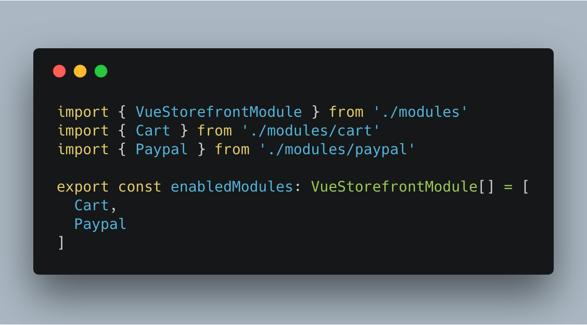

# Vue Storefront PayPal Payment Extension

PayPal Payment extension for [vue-storefront](https://github.com/DivanteLtd/vue-storefront), by [Develo Design](https://www.develodesign.co.uk).

## The architecture


## Installation:

By hand (preferer):
```shell
$ git clone git@github.com:develodesign/vsf-payment-paypal.git ./vue-storefront/core/modules/paypal
```

Or as dependency. Add the extension to your Vue Storefront `package.json` using:
```shell
$ npm install vsf-payment-paypal --save
```

Add the following also to your `config/local.json` need set `paypal.env` to `sandbox` or `production`.
```json
"paypal": {
  "env": "sandbox",
  "create_endpoint": "http://localhost:8080/api/ext/payment-paypal/create",
  "execute_endpoint": "http://localhost:8080/api/ext/payment-paypal/execute"
}
```

Registration the Paypal module. Go to `./core/modules-entry.ts`



## PayPal payment API extension

Install additional extension for `vue-storefront-api`:
```shell
$ mkdir -p ../vue-storefront-api/src/api/extensions/payment-paypal
$ cp -f ./api-ext/index.js ../vue-storefront-api/src/api/extensions/payment-paypal/
```

Go to api config  `./vue-storefront-api/config/local.json` and register the Paypal Api extension:
```
"registeredExtensions": [
    ...
    "payment-paypal"
]
```

And add the `paypal` settings to `extensions` key:
```
  "extensions": {
    "mailchimp": {
      ...
    },
    "paypal": {
      "api": "https://api.sandbox.paypal.com",
      "client": "",
      "secret": ""
    }
  }
```

## Magento2 integration

This API extension execute payment to PayPal gateway.
It use `develodesign/m2-paypal-payment` [The custom Paypal payment method for Magento2](https://github.com/develodesign/m2-paypal-payment) composer module so you have to install it in your Magento instance.

## Customization

Also we can use `paypal.style` option for more customizable PayPal button view. For more info [PayPal](https://developer.paypal.com/demo/checkout/#/pattern/checkout).

```json
"paypal": {
  ...
  "style": {
    "size": "small",
    "color": "gold",
    "shape": "pill"
  }
}
```
